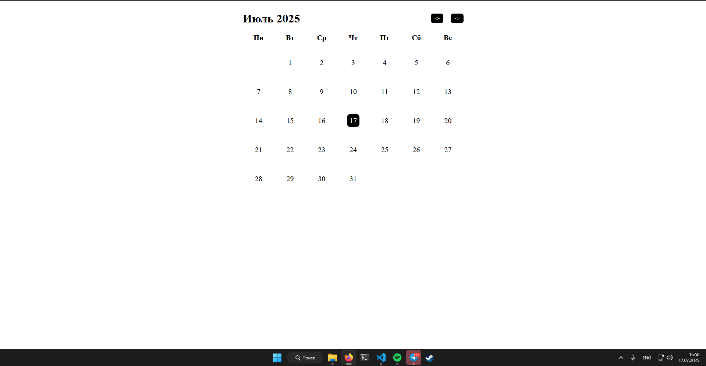
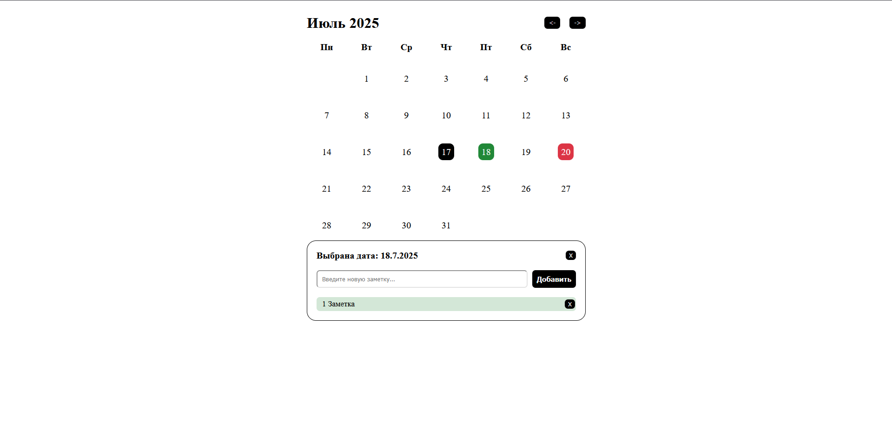

# Vue Calendar App (Календарь-ежедневник на Vue.js)

Это простое, но функциональное веб-приложение "Календарь-ежедневник", созданное с использованием фреймворка **Vue 3** и инструментов сборки **Vite**. Приложение демонстрирует ключевые концепции Vue, такие как компонентный подход, реактивность, управление состоянием и взаимодействие с `localStorage`.

**[Посмотреть демо на GitHub Pages](https://ichera.github.io/NoteCalendar/)**



## 🚀 Основной функционал

*   **Интерактивный календарь:** Навигация по месяцам с помощью слайдера.
*   **Выделение дат:** Текущий день и выбранная дата подсвечиваются для удобства.
*   **Управление заметками:**
    *   При клике на дату открывается панель для работы с заметками.
    *   Возможность добавлять новые заметки на любую будущую дату или на сегодня.
    *   Отметка заметок как "выполненных" с визуальным изменением статуса.
    *   Удаление заметок.
*   **Индикация на календаре:** Дни, на которых есть заметки, отмечаются специальным индикатором. Цвет индикатора меняется, если все заметки на этот день выполнены.
*   **Сохранение данных:** Все заметки автоматически сохраняются в `localStorage` браузера, поэтому они не исчезнут после перезагрузки страницы.



## 🛠️ Технологии и подходы

Этот проект построен на следующих технологиях и принципах:

*   **Vue 3 (Composition API):** Вся логика написана с использованием `<script setup>`.
*   **Vite:** Современный и быстрый сборщик проектов, обеспечивающий мгновенную горячую перезагрузку (HMR).
*   **Компонентная архитектура:** Приложение разделено на логические, переиспользуемые компоненты:
    *   `App.vue` - главный компонент, управляющий состоянием.
    *   `Calendar.vue` - отображает сетку календаря.
    *   `SliderMonth.vue` - компонент для навигации по месяцам.
    *   `NoteItems.vue` - отвечает за интерфейс работы с заметками.
*   **Реактивное управление состоянием:** Используются `ref` и `computed` для создания реактивных данных, а также `watch` для синхронизации состояния с `localStorage`.
*   **Однонаправленный поток данных:** Четкое следование принципу "props down, events up" для предсказуемого взаимодействия между компонентами.
*   **Современный CSS:** Для верстки календаря используется **CSS Grid**, а для интерактивности — динамические классы и плавные `transition`.

## ⚙️ Как запустить проект локально

1.  Клонируйте репозиторий:
    ```bash
    git clone https://github.com/iCHera/NoteCalendar.git
    ```

2.  Перейдите в папку проекта:
    ```bash
    cd NoteCalendar
    ```

3.  Установите зависимости:
    ```bash
    npm install
    ```

4.  Запустите сервер для разработки:
    ```bash
    npm run dev
    ```

